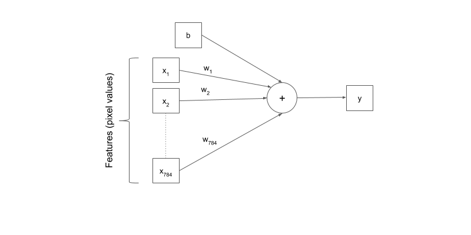

# Task 1: Introduction

Welcome to Basic Image Classification with TensorFlow.

This graph describes the problem that we are trying to solve visually. We want to create and train a model that takes an image of a hand written digit as input and predicts the class of that digit, that is, it predicts the digit or it predicts the class of the input image.

### Import TensorFlow
import tensorflow as tf

tf.logging.set_verbosity(tf.logging.ERROR)
print('Using TensorFlow version', tf.__version__)
# Task 2: The Dataset
### Import MNIST
from tensorflow.keras.datasets import mnist
(x_train,y_train),(x_test,y_test)= mnist.load_data()
### Shapes of Imported Arrays
print('x_train shape:', x_train.shape)
print('y_train shape:', y_train.shape)
print('x_test shape:', x_test.shape)
print('y_test shape:', y_test.shape)
### Plot an Image Example
from matplotlib import pyplot as plt
%matplotlib inline

plt.imshow(x_train[0], cmap='binary')
plt.show()
### Display Labels
y_train[0]
print(set(y_train))
# Task 3: One Hot Encoding
After this encoding, every label will be converted to a list with 10 elements and the element at index to the corresponding class will be set to 1, rest will be set to 0:

| original label | one-hot encoded label |
|------|------|
| 5 | [0, 0, 0, 0, 0, 1, 0, 0, 0, 0] |
| 7 | [0, 0, 0, 0, 0, 0, 0, 1, 0, 0] |
| 1 | [0, 1, 0, 0, 0, 0, 0, 0, 0, 0] |

### Encoding Labels
from tensorflow.keras.utils import to_categorical

y_train_encoded = to_categorical(y_train)
y_test_encoded = to_categorical(y_test)
### Validated Shapes
print('y_train_encoded shape:', y_train_encoded.shape)
print('y_test_encoded shape:', y_test_encoded.shape)

### Display Encoded Labels
y_train_encoded[0]
# Task 4: Neural Networks

### Linear Equations

The above graph simply represents the equation:

\begin{equation}
y = w1 * x1 + w2 * x2 + w3 * x3 + b
\end{equation}

Where the `w1, w2, w3` are called the weights and `b` is an intercept term called bias. The equation can also be *vectorised* like this:

\begin{equation}
y = W . X + b
\end{equation}

Where `X = [x1, x2, x3]` and `W = [w1, w2, w3].T`. The .T means *transpose*. This is because we want the dot product to give us the result we want i.e. `w1 * x1 + w2 * x2 + w3 * x3`. This gives us the vectorised version of our linear equation.

A simple, linear approach to solving hand-written image classification problem - could it work?

### Neural Networks

This model is much more likely to solve the problem as it can learn more complex function mapping for the inputs and outputs in our dataset.
# Task 5: Preprocessing the Examples

### Unrolling N-dimensional Arrays to Vectors
import numpy as np
x_train_reshaped = np.reshape(x_train, (60000, 784))
x_test_reshaped = np. reshape(x_test, (10000, 784))

print('x_train_reshaped shape:', x_train_reshaped.shape)
print('x_test_reshaped shape:', x_test_reshaped.shape)
### Display Pixel Values
print(set(x_train_reshaped[0]))
### Data Normalization
x_mean = np.mean(x_train_reshaped)
x_std = np.std(x_train_reshaped)

epsilon = 1e-10

x_train_norm = (x_train_reshaped - x_mean) / (x_std + epsilon)
x_test_norm = (x_test_reshaped - x_mean) / (x_std + epsilon)

### Display Normalized Pixel Values
print(set(x_train_norm[0]))
# Task 6: Creating a Model
### Creating the Model
from tensorflow.keras.models import Sequential
from tensorflow.keras.layers import Dense

model = Sequential({
    Dense(128, activation='relu', input_shape=(784,)),
    Dense(128, activation='relu'),
    Dense(10, activation='softmax')
})
### Activation Functions

The first step in the node is the linear sum of the inputs:
\begin{equation}
Z = W . X + b
\end{equation}

The second step in the node is the activation function output:

\begin{equation}
A = f(Z)
\end{equation}

Graphical representation of a node where the two operations are performed:

### Compiling the Model
model.compile(
    optimizer='sgd',
    loss='categorical_crossentropy',
    metrics=['accuracy']
)
model.summary()
# Task 7: Training the Model

### Training the Model
model.fit(x_train_norm, y_train_encoded, epochs=3)
### Evaluating the Model
_, accuracy = model.evaluate(x_test_norm, y_test_encoded)
print('Test set accuracy: ',accuracy*100)
# Task 8: Predictions

### Predictions on Test Set
preds = model.predict(x_test_norm)
print('Shape of preds:', preds.shape )
### Plotting the Results
plt.figure(figsize=(12,12))

start_index = 0

for i in range(25):
    plt.subplot(5, 5, i+1)
    plt.grid(False)
    plt.xticks([])
    plt.yticks([])
    
    pred = np.argmax(preds[start_index+i])
    gt = y_test[start_index+i]
    
    col = 'g'
    if pred != gt:
        col = 'r'
        
    plt.xlabel('i={}, pred={}, gt={}'.format(start_index+i, pred, gt),color=col)
    plt.imshow(x_test[start_index+i], cmap='binary')
plt.show()
plt.plot(preds[8])
plt.show()

